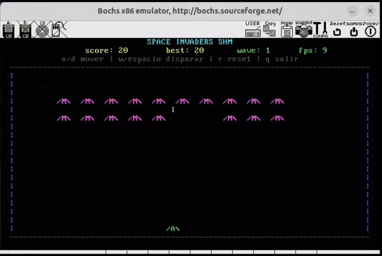

# SOA — Advanced Operating Systems (FIB-UPC)

Course materials and lab work for [Sistemas Operativos Avanzados (SOA)](https://docencia.ac.upc.edu/FIB/grau/SOA/) at the Barcelona School of Informatics (FIB-UPC).

##  Project: Space Invaders on a custom OS kernel

Final project (**grade: 10/10**): a Space Invaders game running on **ZeOS**, an operating system built during the course lab. The game runs on top of the kernel features implemented in the previous deliverables: system calls, interrupt handling and process management.

## Lab: building ZeOS

Design and implementation of **ZeOS**, an educational operating system, starting from a minimal base code:

- **Deliverable 1:** system calls and interrupt handling.
- **Deliverable 2:** data structures and scheduling algorithms for process management in a multiprocess system.
- **Final project:** Space Invaders, built on top of the previous deliverables.

## Theory

- Study notes covering both midterm exams, written from the lectures.
- Exams.
- Slides.

##  Repository structure

| Folder | Content |
|---|---|
| `Lab/` | ZeOS deliverables 1 and 2 |
| `Proyecto/` | Space Invaders on ZeOS |
| `Apuntes/` | Theory notes |
| `Exámenes/` | Exams |
| `Transparencias/` | Course slides |
